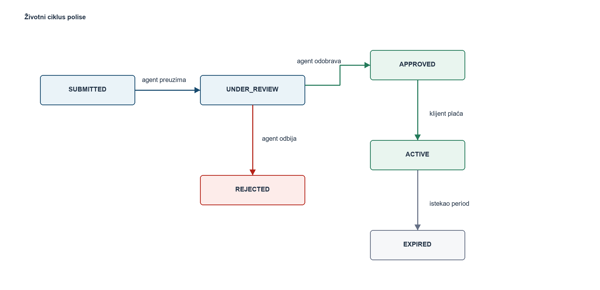

# TravelSafe, web aplikacija za putno osiguranje

Full-stack aplikacija za onlajn izdavanje putnog osiguranja. Sastoji se iz **dve odvojene aplikacije**:

- **`backend/`**, Laravel 10 REST API (PHP, Eloquent ORM, Sanctum autentifikacija, MySQL)
- **`frontend/`**, React 19 SPA (Create React App, React Router, Axios, Tailwind CSS)

React šalje HTTP zahteve Laravel API-ju; Laravel obrađuje poslovnu logiku i pristupa bazi.

Kod je pisan na engleskom, a komentari koji objašnjavaju delove koda na srpskom.

---

## Tehnologije

| Sloj | Tehnologije |
|------|-------------|
| Frontend | React, JavaScript (JSX), Create React App (react-scripts), React Router, Axios, Tailwind CSS |
| Backend | Laravel 10, PHP 8.2, Eloquent ORM, Laravel Sanctum |
| Baza | MySQL |
| Dokumentacija API-ja | OpenAPI 3.0.3 + Swagger UI |
| Pokretanje | Docker + Docker Compose (php:8.2-cli, node:24-alpine + nginx, mysql:8.0) |

## Korisničke uloge

- **CLIENT**, pregleda pakete, unosi putovanja i putnike, podnosi zahteve, simulira plaćanje.
- **AGENT**, pregleda pristigle zahteve, odobrava/odbija ih i unosi konačnu cenu.
- **ADMIN**, upravlja korisnicima i paketima, vidi sve polise i osnovnu statistiku.

---

## Preduslovi

Za pokretanje kroz **Docker** (najjednostavnije) dovoljan je samo:

- Docker Desktop (uz Docker Compose)

Za klasično lokalno pokretanje bez Dockera:

- PHP >= 8.2 i Composer
- Node.js >= 24 i npm
- MySQL (npr. iz XAMPP-a)

## Pokretanje bez Dockera, Backend (Laravel)

```bash
cd backend

# 1. Instalacija zavisnosti (ako već nije urađeno)
composer install

# 2. Kreirajte bazu "travelsafe" u MySQL-u (npr. kroz phpMyAdmin ili komandu):
#    CREATE DATABASE travelsafe;
#    Podaci za konekciju se podešavaju u fajlu .env (DB_DATABASE=travelsafe).

# 3. Migracije + početni podaci (demo nalozi i paketi)
php artisan migrate --seed

# 4. Pokretanje API servera na http://localhost:8000
php artisan serve
```

## Pokretanje bez Dockera, Frontend (React)

```bash
cd frontend

# 1. Instalacija zavisnosti (ako već nije urađeno)
npm install

# 2. Pokretanje razvojnog servera na http://localhost:3000
npm start
```

Otvorite `http://localhost:3000` u pregledaču (CRA sam otvara pregledač pri pokretanju).

---

## Pokretanje kroz Docker (preporučeno)

Uz instaliran **Docker Desktop** nije potrebno lokalno instalirati PHP, Node ni MySQL.
Iz korena projekta (`TravelSafe/`) pokrenite:

```bash
docker compose up --build
```

Prvo pokretanje traje nekoliko minuta (preuzimanje slika i instalacija zavisnosti),
a svako sledeće je znatno brže. Kada se ispiše `Server running on [http://0.0.0.0:8000]`,
sve je spremno:

| Servis | Adresa |
|--------|--------|
| Frontend (React) | http://localhost:3000 |
| Backend API (Laravel) | http://localhost:8000/api |
| Swagger UI (API dokumentacija) | http://localhost:8000/api-docs/ |
| MySQL baza | `localhost:3307` (korisnik `root`, lozinka `root`) |

Zaustavljanje:

```bash
docker compose down
```

Brisanje i podataka iz baze (potpuno čisto stanje):

```bash
docker compose down -v
```

### Šta se dešava pri pokretanju

`docker-compose.yml` opisuje tri servisa:

- **`db`**, zvanična slika `mysql:8.0` sa bazom `travelsafe`. Podaci se čuvaju u
  Docker volume-u `travelsafe-db-data`, pa preživljavaju gašenje kontejnera.
  Port je mapiran na `3307` da ne bi bilo sudara sa lokalnim MySQL-om iz XAMPP-a.
- **`backend`**, slika iz `backend/Dockerfile` (PHP 8.2 + Composer + `mysql-client`).
  Skripta `backend/docker/entrypoint.sh` izvršava se pri **svakom** pokretanju
  kontejnera i prolazi kroz šest koraka opisanih ispod.
- **`frontend`**, slika iz `frontend/Dockerfile`, u dve faze: prvo `npm run build`
  (Node), zatim se dobijeni statički fajlovi serviraju kroz `nginx`. Konfiguracija
  `frontend/docker/nginx.conf` vraća `index.html` za svaku nepoznatu putanju,
  jer React Router radi na strani pregledača.

### Migracije i seed pri svakom pokretanju

Ulazna skripta backend kontejnera radi sledeće:

1. **Čeka bazu**, `mysqladmin ping --skip-ssl` u petlji, dok MySQL ne prihvati konekciju.
2. **Priprema `.env`**, kopira `.env.example` i u njega upisuje `DB_*`, `APP_URL`,
   `FRONTEND_URL` i `CORS_ALLOWED_ORIGINS` vrednosti iz `docker-compose.yml`.
3. **Čisti keš**, `config:clear`, `cache:clear`, `route:clear`, `view:clear`.
4. **Generiše `APP_KEY`**, `php artisan key:generate --force`.
5. **Migrira i puni bazu**, `php artisan migrate:fresh --seed --force`.
6. **Pokreće server**, `php artisan serve --host=0.0.0.0 --port=8000`.

Zbog petog koraka svako pokretanje backend kontejnera vraća bazu na demo sadržaj iz
klase `DatabaseSeeder`, pa svi dobijaju isto, unapred poznato stanje sistema. Ako
treba sačuvati unete podatke između pokretanja, u `backend/docker/entrypoint.sh`
zameniti `migrate:fresh --seed` sa `migrate`.

Posle seed-a baza sadrži pet korisnika, četiri paketa osiguranja (od kojih je jedan
povučen iz ponude) i sedam polisa raspoređenih po svim statusima životnog ciklusa, dve aktivne, jednu odobrenu koja čeka plaćanje, jednu odbijenu i tri podneta zahteva.

Korak 2 postoji zbog jedne osobenosti Laravela: kada `.env` datoteka postoji,
`php artisan serve` detetu procesu prosleđuje samo ograničen skup promenljivih
okruženja, pa bi server čitao podrazumevani `DB_HOST=127.0.0.1` umesto vrednosti
iz `docker-compose.yml`.

Adresa API-ja se u React build ugrađuje kroz build argument `REACT_APP_API_URL`
(CRA čita `REACT_APP_*` promenljive u trenutku build-a, ne pri pokretanju), pa se
menja u `docker-compose.yml`, a ne u `.env` fajlu.

---

## API dokumentacija (Swagger / OpenAPI)

Specifikacija je pisana ručno u OpenAPI 3.0.3 formatu i stoji uz backend:

```
backend/public/api-docs/
├── index.html      # Swagger UI stranica (učitava se sa unpkg CDN-a)
└── openapi.yaml    # OpenAPI 3.0.3 specifikacija svih 32 rute
```

Pošto je `public/` koren Laravel aplikacije, dokumentacija je dostupna čim backend radi:

**http://localhost:8000/api-docs/**

(radi i uz `php artisan serve` i uz Docker)

### Kako se testira kroz Swagger

1. Otvorite `POST /api/auth/login` → **Try it out**. U padajućem spisku primera
   izaberite nalog (CLIENT / AGENT / ADMIN) i kliknite **Execute**.
2. Token se **automatski** upisuje u dugme **Authorize** (to radi `responseInterceptor`
   u `index.html`), pa ne mora ručno da se kopira.
3. Sve zaštićene rute od tog trenutka šalju zaglavlje `Authorization: Bearer <token>`.

Specifikacija dokumentuje i tačan oblik odgovora: uspešni odgovori kontrolera imaju
omotač `{ success, message, data }` (iz `app/Traits/ApiResponse.php`), dok greške koje
generiše sam Laravel (validacija 422, `Unauthenticated.` 401, 404) vraćaju kraći oblik
`{ message }`, odnosno `{ message, errors }`.

---

## Demo nalozi (lozinka: `password`)

| Uloga | Email |
|-------|-------|
| ADMIN | `admin@travelsafe.test` |
| AGENT | `agent@travelsafe.test` |
| CLIENT | `ana@travelsafe.test` |

---

## Struktura backenda

- **Modeli** (`app/Models`): `User`, `InsurancePackage`, `Travel`, `InsuredPerson`, `Policy`, povezani Eloquent relacijama.
- **Migracije** (`database/migrations`): kreiranje tabela, dodavanje kolona (`is_active`, `rejection_reason`), strani ključevi + jedinstvena ograničenja, dodavanje indeksa.
- **Middleware**: `auth:sanctum` (autentifikacija) + `RoleMiddleware` (`role:ADMIN`, `role:AGENT,ADMIN`).
- **Kontroleri** (`app/Http/Controllers/Api`): `AuthController`, `UserController`, `InsurancePackageController`, `TravelController`, `InsuredPersonController`, `PolicyController`, `StatisticsController`.
- **CORS** (`config/cors.php`): eksplicitno nabrojani dozvoljeni origin-i, metode i zaglavlja.
- **API dokumentacija** (`public/api-docs`): `openapi.yaml` + Swagger UI stranica.
- **Docker** (`Dockerfile`, `docker/entrypoint.sh`): slika sa PHP-om; migracije i seed se izvršavaju pri svakom pokretanju.
- Svi odgovori su u JSON formatu, oblika `{ success, message, data }`.

### Glavne API rute

```
POST   /api/auth/register            POST /api/auth/login
POST   /api/auth/logout              GET  /api/auth/me

GET    /api/insurance-packages       (javno; ADMIN: POST/PUT/DELETE)
GET/POST/PUT/DELETE /api/travels
GET/POST /api/travels/{id}/insured-persons
GET/PUT/DELETE /api/insured-persons/{id}
GET/POST/PUT/DELETE /api/policies
PATCH  /api/policies/{id}/approve    (AGENT)
PATCH  /api/policies/{id}/reject     (AGENT)
PATCH  /api/policies/{id}/pay        (CLIENT)
GET    /api/statistics               (ADMIN)
```

## Struktura frontenda

```
docker/           # nginx.conf (SPA fallback za React Router)
public/           # index.html (HTML ljuska) + statičke ikonice
src/
├── index.jsx     # ulazna tačka aplikacije
├── components/   # ui/ (Button, FormInput, Card, Modal, Badge, Spinner) + layout/
├── pages/        # javne + client/ + agent/ + admin/ stranice
├── services/     # Axios servisi po resursu (api.js + *Service.js)
├── context/      # AuthContext (prijavljeni korisnik)
├── hooks/        # useAuth
├── routes/       # ProtectedRoute (zaštita ruta po ulozi)
└── utils/        # constants.js, format.js
```

## Glavni tok aplikacije



Dijagram prikazuje dozvoljene prelaze polise kroz statuse. Svaki prelaz izvodi
tačno jedna uloga, a kontroler odbija prelaz iz statusa koji nije predviđen.

1. Korisnik se registruje i prijavljuje (React → Laravel, dobija Sanctum token).
2. Klijent bira paket, unosi putovanje i osigurane osobe (uz automatski obračun okvirne cene).
3. Podaci se šalju API-ju koji kreira putovanje, putnike i polisu (status `SUBMITTED`).
4. Agent pregleda zahtev i odobrava (unosi cenu) ili odbija (unosi razlog).
5. Klijent simulira plaćanje odobrene polise → status `ACTIVE`.
